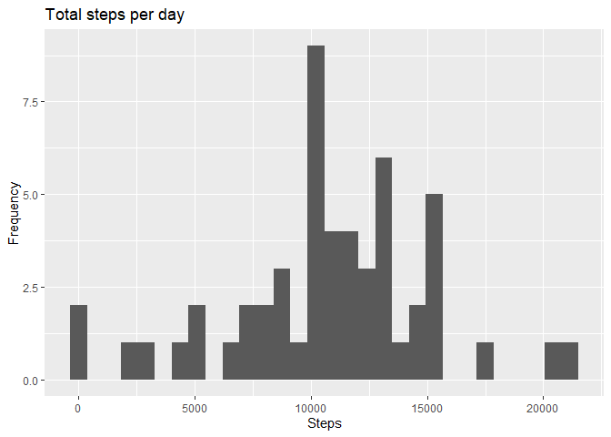
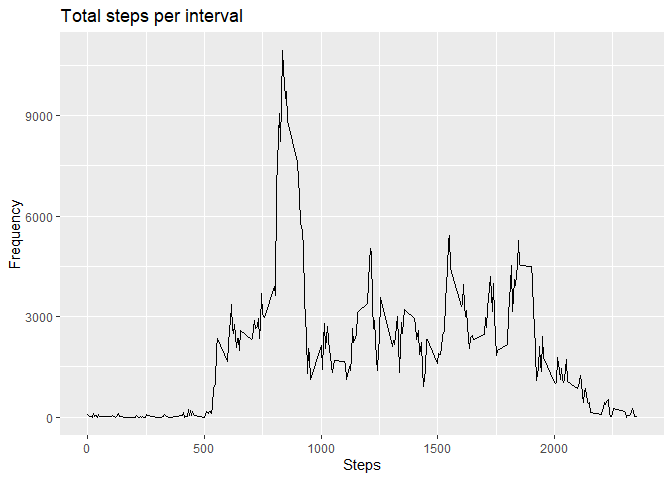
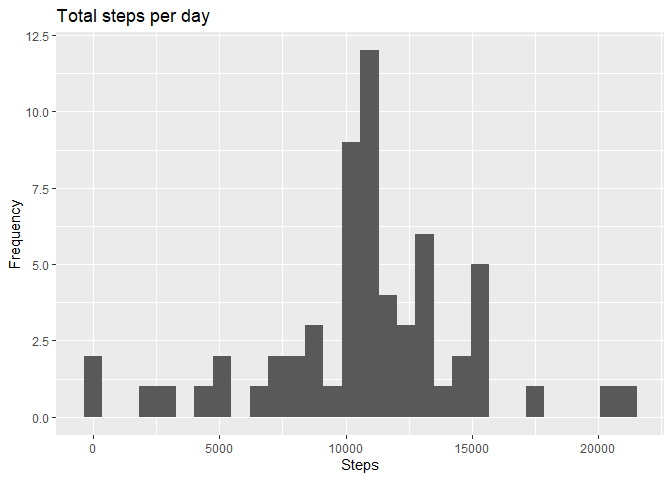
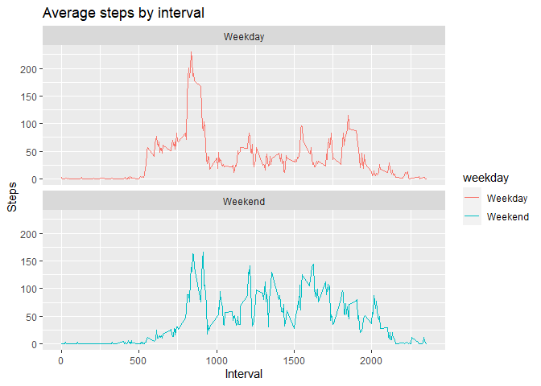

```r
library(ggplot2)
```

```
## Warning: package 'ggplot2' was built under R version 3.6.3
```

```r
library(dplyr)
```

```
## 
## Attaching package: 'dplyr'
```

```
## The following objects are masked from 'package:stats':
## 
##     filter, lag
```

```
## The following objects are masked from 'package:base':
## 
##     intersect, setdiff, setequal, union
```

## Loading and preprocessing the data

1. Load the data:

```r
#Download the data if file is not in the wd
if  (!file.exists('repdata_data_activity.zip')) {
      download.file('https://d396qusza40orc.cloudfront.net/repdata%2Fdata%2Factivity.zip', 
                    destfile = './repdata_data_activity.zip')
  }
#read the data
df = read.csv(unz('repdata_data_activity.zip', 'activity.csv'), header = TRUE, sep = ',')
```
2. Process/transform the data (if necessary) into a format suitable for your analysis:

```r
#convert date to the appropriate format
df$date = as.Date(df$date, format="%Y-%m-%d")
```

## What is mean total number of steps taken per day?
  
1. Calculate the total number of steps taken per day

```r
#Agregate steps by date
stepsPerDay <- aggregate(df$steps, by=list(date=df$date), FUN=sum)
```
2. Make a histogram of the total number of steps taken each day

```r
ggplot(stepsPerDay, aes(x=x)) + geom_histogram() + labs(title='Total steps per day', x='Steps', y='Frequency')
```

```
## `stat_bin()` using `bins = 30`. Pick better value with `binwidth`.
```

```
## Warning: Removed 8 rows containing non-finite values (stat_bin).
```

<!-- -->

3. Calculate and report the mean and median of the total number of steps taken per day

```r
avgdf <- data.frame(Mean_Steps = mean(stepsPerDay$x,na.rm = TRUE), Median_Steps = median(stepsPerDay$x,na.rm = TRUE))
avgdf
```

```
##   Mean_Steps Median_Steps
## 1   10766.19        10765
```

## What is the average daily activity pattern?

1. Make a time series plot (i.e. \color{red}{\verb|type = "l"|}type = "l") of the 5-minute interval (x-axis) and the average number of steps taken, averaged across all days (y-axis)

```r
#Agregate steps by interval
stepsPerInterval <- aggregate(df$steps, by=list(interval=df$interval), FUN=sum, na.rm=TRUE)
#Make plot
ggplot(data=stepsPerInterval, aes(x=interval, y=x, group=1)) + geom_line()+labs(title='Total steps per interval', x='Steps', y='Frequency')
```

<!-- -->

2. Which 5-minute interval, on average across all the days in the dataset, contains the maximum number of steps?

```r
#rename columns
names(stepsPerInterval) <- c('date', 'steps')
stepsPerInterval[stepsPerInterval$steps==max(stepsPerInterval),]
```

```
##     date steps
## 104  835 10927
```

## Imputing missing values
1. Calculate and report the total number of missing values in the dataset (i.e. the total number of rows with \color{red}{\verb|NA|}NAs)

```r
sum(is.na(df))
```

```
## [1] 2304
```
2. Devise a strategy for filling in all of the missing values in the dataset. The strategy does not need to be sophisticated. For example, you could use the mean/median for that day, or the mean for that 5-minute interval, etc.
3. Create a new dataset that is equal to the original dataset but with the missing data filled in.

```r
#Filling the new df with mean steps per interval
dffill <- df
dffill$steps[is.na(df$steps)] <- ave(df$steps, df$interval,FUN=function(x)mean(x,na.rm = TRUE))[is.na(df$steps)]
```
4. Make a histogram of the total number of steps taken each day and Calculate and report the mean and median total number of steps taken per day. Do these values differ from the estimates from the first part of the assignment? What is the impact of imputing missing data on the estimates of the total daily number of steps?

```r
#Aggregate steps by date
stepsPerDayfill <- aggregate(dffill$steps, by=list(date=dffill$date), FUN=sum)
#Make plot
ggplot(stepsPerDayfill, aes(x=x)) + geom_histogram() + labs(title='Total steps per day', x='Steps', y='Frequency')
```

```
## `stat_bin()` using `bins = 30`. Pick better value with `binwidth`.
```

<!-- -->

```r
#Calculate new averages and merge them with old ones
avgdf <- rbind(avgdf, data.frame(Mean_Steps = mean(stepsPerDayfill$x,na.rm = TRUE), Median_Steps = median(stepsPerDayfill$x,na.rm = TRUE)))
avgdf['Data'] = c('Before Impting', 'After Imputing')
avgdf
```

```
##   Mean_Steps Median_Steps           Data
## 1   10766.19     10765.00 Before Impting
## 2   10766.19     10766.19 After Imputing
```

We can see that Mean number of steps is the same, as we used mean per interval to fill misiing values, but Median changes a little bit.

## Are there differences in activity patterns between weekdays and weekends?
1. Create a new factor variable in the dataset with two levels - "weekday" and "weekend" indicating whether a given date is a weekday or weekend day.

```r
dffill['Weekday'] <- as.factor(ifelse(weekdays(dffill$date) %in% c('Saturday', 'Sunday'), "Weekend", "Weekday"))
```

2. Make a panel plot containing a time series plot (i.e. \color{red}{\verb|type = "l"|}type = "l") of the 5-minute interval (x-axis) and the average number of steps taken, averaged across all weekday days or weekend days (y-axis). See the README file in the GitHub repository to see an example of what this plot should look like using simulated data.

```r
stepsPerIntWeekday <- aggregate(dffill$steps, by=list(weekday=dffill$Weekday, interval=dffill$interval), FUN=mean, na.rm=TRUE)
ggplot(stepsPerIntWeekday, aes(x=interval, y=x, color=weekday)) + geom_line() + facet_wrap(weekday ~ ., ncol=1, nrow = 2) + labs(title = 'Average steps by interval', x='Interval', y='Steps')
```

<!-- -->


